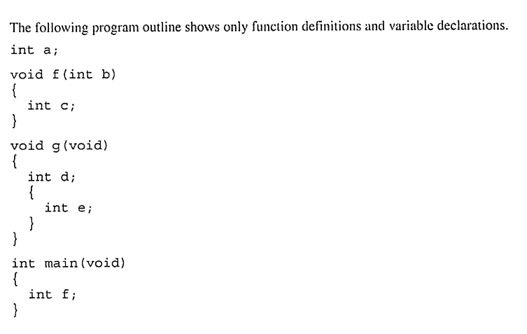

# Chapter 10: Program Organisation

## Exercises

1. 

(a) variables/parameters in f: a, b, c

(b) variables/parameters in g: a, d, e

(c) variables/parameters in the e block: a, d, e 

(d) variables/parameters in main: a, f

2. ex2.png

(a) f: b2, c, d 

(b) g: a1, a2, b1, c2, d2

(c) ad block: a2, d2, c2, b1

(d) main: b1, c3, d3

3. If a program only has one main function then the number of variables named i is still as main as the programmer desires as they can just keep adding blocks.

## Projects

1. bracketChecker.c 

This program is a reuse is a modified version of the stack.c program.

It will take in a series of characters from the user and check if the brackets are nested correctly

It does this by pushing open brackets '(' or '{' into the stack.

When a closed bracket comes up, the stack is popped to check if the top char in the stack is a corresponding opening bracket

Example below:

    Enter parentheses and/or braces: (({{}}))
    Parentheses/braces are nested properly

    Enter parentheses and/or braces: {{((})}}
    Parentheses/braces are not nested properly

2. poker.c modified

This first modification was done to move several arrays from global scope into the scope of main.

3. poker3.c

This is a further modification that changes the way the 5 cards are stored.

They are now stored in a 5x2 array called cards so a royal flush of clubs would look like the below:

    {{'t', 'c'},
     {'j', 'c'},
     {'q', 'c'},
     {'k', 'c'},
     {'a', 'c'}}

This required reworking the read_hand and analyse_hand functions significantly.

For instance the analyser now checks the sum of the differences between each cards rank to tell whether the hand is a straight.

4. recognising royal flushes 

I then modified poker3.c to be able to recognise royal flushes. It does this by checking whether all the cards ranks are above 9. If the hand is also a straight flush then it must be a royal flush

5. allowing ace-low straights 

To allow ace low straights I calculated an additional sum of differences setting ace to be worth 0 rather than 12. If the either sum equals 40 then the hand must be a straight

6. RPN.c 

This program is able to do sums in Reverse Polish Notation. It does this by stacking the operands until an operator appears. When one does then it will pop the last two operands and perform the calculation then push the answer back into the stack. Finally the equal '=' sign will just output the top of the stack and then clear it. Example below:

    Enter an RPN expression: 5 5 * 6 7 + * =
    Value of expression: 325


7. sevenSeg.c

This project involved using the segment array from chapter 8 to be able to print out
numbers given by the user in a seven segment array type format:

```
```
    Enter a number: 0123456789

     _       _   _       _   _   _   _   _
    | |   |  _|  _| |_| |_  |_    | |_| |_|
    |_|   | |_   _|   |  _| |_|   | |_|  _|
```
```
