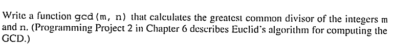
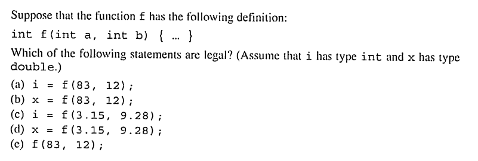
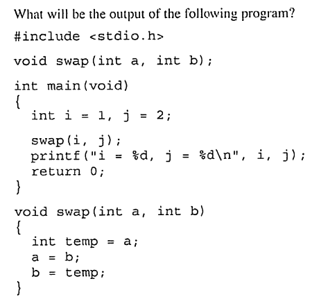

# Chapter 9: Functions

## Exercises

### 1. Locate Errors

The first error is not providing the type for `height` and the second is `double product` should be within the braces.

### 2. Check Function

See ex2.c

### 3. gcd Function

Essentially just copied gcd.c from chapter 6 and split out the gcd logic into its own function

See ex3.c

### 4. day_of_year function

See ex4.c. Short program that outputs the day of the year for a given day, month and year:

    Please enter a date (dd/mm/yyyy): 09/05/2025
    Day of the year: 129

### 5. num_digits function

See ex5.c. Wrote a function that returns the number of digits in an integer:

    Enter a number: 1234567
    1234567 has 7 digits

### 6. digit function

see ex6.c. Gets the specified digit. Reused the num_digits function

    Enter a number: 123456789
    Which digit you want (from the right): 5
    5

### 7. Legal Statements

Have checked this by compiling a program that uses all of the above statements and faced no errors/warnings.
The values are just converted between double and int whenever necessary

### 8. Valid Prototypes

#### (a) `void f(double x);` is a valid prototype

#### (b) `void f(double);` is valid because the parameter names can be omitted in the prototype

#### (c) `void f(x)` not valid because the parameter type needs to be specified

#### (d) `f(double x);` not valid because this will not be a void function but rather an int function

### 9. Output of Program

This will not swap i and j as the author is probably expecting. This is because a and b are copies and local to the swap function

the output will be:

    i = 1, j = 2

### 10. various array functions

see ex10.c which functions that compute the largest element, the average and the positive elements of an array

### 11. 